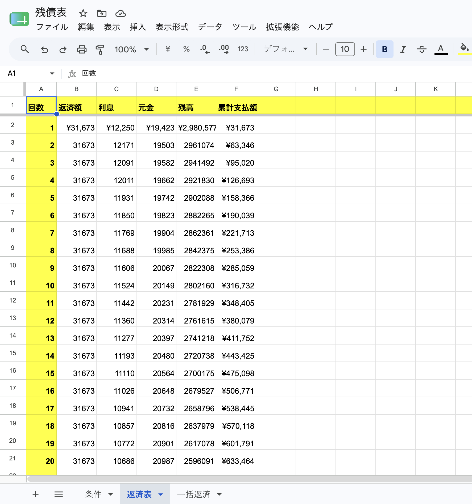
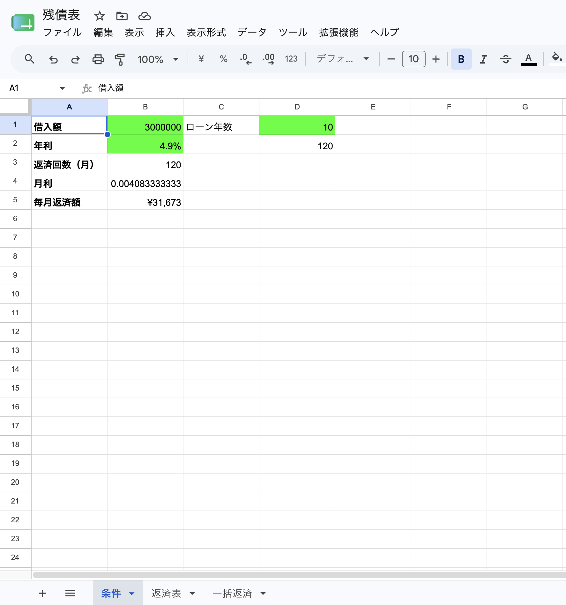
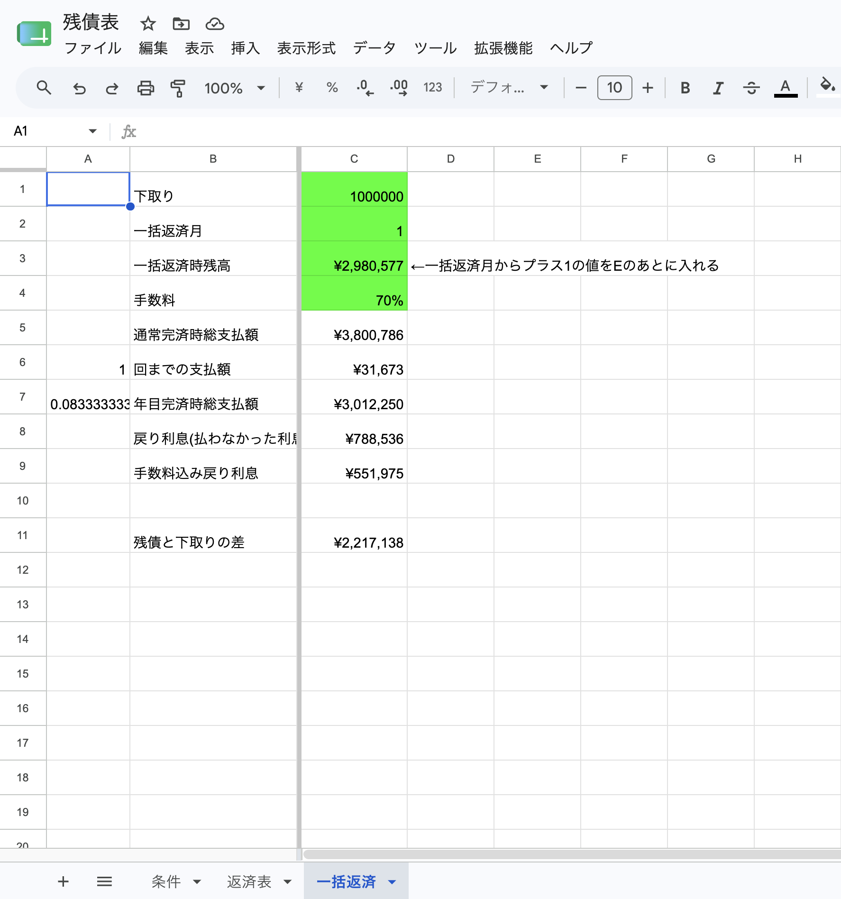

# loan-simulator-Spreadsheet-Prototype-
Loan calculator Spreadsheet Prototype

## Screenshots

### Input

This spreadsheet was created to verify the loan calculation logic
before implementing the application in PHP.

Features

・PMT calculation
・Monthly repayment schedule
・Remaining balance calculation
・Early payoff simulation
・Interest saving calculation
・Payoff fee calculation

# Screenshots

### loan-simulator

The spreadsheet was later converted into a WordPress PHP application.
